```mermaid
%%{
  init: {
    'theme': 'neutral'
  }
}%%

graph LR
  subgraph :app-config
    :app-config:api["api"]
    :app-config:remote["remote"]
    :app-config:default["default"]
  end
  subgraph :feature
    :feature:goal["goal"]
    :feature:account["account"]
    :feature:settings["settings"]
    :feature:workspace["workspace"]
    :feature:budget["budget"]
    :feature:category["category"]
    :feature:dashboard["dashboard"]
    :feature:login["login"]
    :feature:transaction["transaction"]
  end
  subgraph :sync
    :sync:api["api"]
    :sync:default["default"]
    :sync:no-op["no-op"]
  end
  :feature:goal --> :domain
  :feature:goal --> :navigation
  :feature:goal --> :sync:api
  :feature:goal --> :uikit
  :feature:goal --> :utils
  :feature:goal --> :domain-test-fixtures
  :feature:goal --> :sync-test-fixtures
  :feature:goal --> :detekt-rules
  :sync:api --> :detekt-rules
  :app-config:api --> :domain
  :app-config:api --> :detekt-rules
  :feature:account --> :domain
  :feature:account --> :navigation
  :feature:account --> :sync:api
  :feature:account --> :uikit
  :feature:account --> :utils
  :feature:account --> :domain-test-fixtures
  :feature:account --> :sync-test-fixtures
  :feature:account --> :detekt-rules
  :sync-surfer --> :domain
  :sync-surfer --> :sync:api
  :sync-surfer --> :sync:default
  :sync-surfer --> :data-local
  :sync-surfer --> :data-remote
  :sync-surfer --> :domain-test-fixtures
  :sync-surfer --> :detekt-rules
  :sync-surfer --> :data-test-fixtures
  :data-local --> :domain
  :data-local --> :sync:api
  :data-local --> :app-config:api
  :data-local --> :detekt-rules
  :data-local --> :domain-test-fixtures
  :feature:settings --> :domain
  :feature:settings --> :navigation
  :feature:settings --> :sync:api
  :feature:settings --> :uikit
  :feature:settings --> :utils
  :feature:settings --> :domain-test-fixtures
  :feature:settings --> :sync-test-fixtures
  :feature:settings --> :detekt-rules
  :feature:workspace --> :domain
  :feature:workspace --> :navigation
  :feature:workspace --> :sync:api
  :feature:workspace --> :uikit
  :feature:workspace --> :utils
  :feature:workspace --> :domain-test-fixtures
  :feature:workspace --> :sync-test-fixtures
  :feature:workspace --> :detekt-rules
  :androidApp-offline --> :detekt-rules
  :androidApp-offline --> :composeAppOffline
  :androidApp-offline --> :shared
  :app-config:remote --> :app-config:api
  :app-config:remote --> :app-config:default
  :app-config:remote --> :detekt-rules
  :shared --> :domain
  :shared --> :app-config:api
  :shared --> :uikit
  :shared --> :utils
  :shared --> :data-local
  :shared --> :navigation
  :shared --> :feature:account
  :shared --> :feature:budget
  :shared --> :feature:category
  :shared --> :feature:dashboard
  :shared --> :feature:goal
  :shared --> :feature:login
  :shared --> :feature:settings
  :shared --> :feature:transaction
  :shared --> :feature:workspace
  :shared --> :domain-test-fixtures
  :shared --> :sync-test-fixtures
  :shared --> :detekt-rules
  :integration-test --> :domain
  :integration-test --> :sync:api
  :integration-test --> :sync:default
  :integration-test --> :data-local
  :integration-test --> :data-remote
  :integration-test --> :sync-surfer
  :integration-test --> :domain-test-fixtures
  :integration-test --> :sync-test-fixtures
  :integration-test --> :data-test-fixtures
  :integration-test --> :detekt-rules
  :androidApp --> :detekt-rules
  :androidApp --> :composeApp
  :androidApp --> :shared
  :uikit --> :detekt-rules
  :composeAppOffline --> :shared
  :composeAppOffline --> :domain
  :composeAppOffline --> :app-config:api
  :composeAppOffline --> :app-config:default
  :composeAppOffline --> :feature:login
  :composeAppOffline --> :feature:transaction
  :composeAppOffline --> :sync:api
  :composeAppOffline --> :sync:no-op
  :composeAppOffline --> :detekt-rules
  :composeAppOffline --> :data-local
  :composeAppOffline --> :navigation
  :composeAppOffline --> :feature:category
  :feature:budget --> :domain
  :feature:budget --> :navigation
  :feature:budget --> :sync:api
  :feature:budget --> :uikit
  :feature:budget --> :utils
  :feature:budget --> :domain-test-fixtures
  :feature:budget --> :sync-test-fixtures
  :feature:budget --> :detekt-rules
  :feature:transaction --> :domain
  :feature:transaction --> :navigation
  :feature:transaction --> :sync:api
  :feature:transaction --> :uikit
  :feature:transaction --> :utils
  :feature:transaction --> :domain-test-fixtures
  :feature:transaction --> :sync-test-fixtures
  :feature:transaction --> :detekt-rules
  :sync:default --> :domain
  :sync:default --> :sync:api
  :sync:default --> :sync-test-fixtures
  :sync:default --> :detekt-rules
  :sync:no-op --> :sync:api
  :sync:no-op --> :detekt-rules
  :data-remote --> :domain
  :data-remote --> :sync:api
  :data-remote --> :detekt-rules
  :feature:login --> :domain
  :feature:login --> :navigation
  :feature:login --> :sync:api
  :feature:login --> :uikit
  :feature:login --> :utils
  :feature:login --> :domain-test-fixtures
  :feature:login --> :sync-test-fixtures
  :feature:login --> :detekt-rules
  :domain --> :sync:api
  :domain --> :domain-test-fixtures
  :domain --> :detekt-rules
  :feature:category --> :domain
  :feature:category --> :navigation
  :feature:category --> :sync:api
  :feature:category --> :uikit
  :feature:category --> :utils
  :feature:category --> :domain-test-fixtures
  :feature:category --> :sync-test-fixtures
  :feature:category --> :detekt-rules
  :app-config --> :detekt-rules
  :data-test-fixtures --> :domain
  :data-test-fixtures --> :detekt-rules
  :navigation --> :domain
  :navigation --> :sync:api
  :navigation --> :uikit
  :navigation --> :detekt-rules
  :feature --> :detekt-rules
  :domain-test-fixtures --> :domain
  :domain-test-fixtures --> :detekt-rules
  :composeApp --> :shared
  :composeApp --> :domain
  :composeApp --> :app-config:api
  :composeApp --> :app-config:default
  :composeApp --> :app-config:remote
  :composeApp --> :feature:login
  :composeApp --> :feature:transaction
  :composeApp --> :data-local
  :composeApp --> :data-remote
  :composeApp --> :sync-surfer
  :composeApp --> :sync:default
  :composeApp --> :detekt-rules
  :composeApp --> :feature:dashboard
  :composeApp --> :feature:settings
  :composeApp --> :uikit
  :composeApp --> :utils
  :composeApp --> :navigation
  :composeApp --> :feature:category
  :composeApp --> :composeAppOffline
  :composeApp --> :data-test-fixtures
  :composeApp --> :domain-test-fixtures
  :composeApp --> :integration-test
  :composeApp --> :sync-test-fixtures
  :composeApp --> :feature:account
  :composeApp --> :feature:budget
  :composeApp --> :feature:goal
  :composeApp --> :feature:workspace
  :composeApp --> :sync:api
  :composeApp --> :sync:no-op
  :app-config:default --> :domain
  :app-config:default --> :app-config:api
  :app-config:default --> :detekt-rules
  :sync --> :detekt-rules
  :utils --> :detekt-rules
  :feature:dashboard --> :domain
  :feature:dashboard --> :navigation
  :feature:dashboard --> :sync:api
  :feature:dashboard --> :uikit
  :feature:dashboard --> :utils
  :feature:dashboard --> :domain-test-fixtures
  :feature:dashboard --> :sync-test-fixtures
  :feature:dashboard --> :detekt-rules
  :sync-test-fixtures --> :domain
  :sync-test-fixtures --> :sync:api
  :sync-test-fixtures --> :sync:default
  :sync-test-fixtures --> :detekt-rules
```

```mermaid
%%{
  init: {
    'theme': 'neutral'
  }
}%%

graph LR
  subgraph :app-config
    :app-config:api["api"]
    :app-config:default["default"]
  end
  subgraph :feature
    :feature:goal["goal"]
    :feature:account["account"]
    :feature:settings["settings"]
    :feature:workspace["workspace"]
    :feature:budget["budget"]
    :feature:category["category"]
    :feature:dashboard["dashboard"]
    :feature:login["login"]
    :feature:transaction["transaction"]
  end
  subgraph :sync
    :sync:api["api"]
    :sync:default["default"]
    :sync:no-op["no-op"]
  end
  :feature:goal --> :domain
  :feature:goal --> :navigation
  :feature:goal --> :sync:api
  :feature:goal --> :uikit
  :feature:goal --> :utils
  :feature:goal --> :domain-test-fixtures
  :feature:goal --> :sync-test-fixtures
  :feature:account --> :domain
  :feature:account --> :navigation
  :feature:account --> :sync:api
  :feature:account --> :uikit
  :feature:account --> :utils
  :feature:account --> :domain-test-fixtures
  :feature:account --> :sync-test-fixtures
  :sync-surfer --> :domain
  :sync-surfer --> :sync:api
  :sync-surfer --> :sync:default
  :sync-surfer --> :data-local
  :sync-surfer --> :data-remote
  :sync-surfer --> :data-test-fixtures
  :sync-surfer --> :domain-test-fixtures
  :app-config:api --> :domain
  :app-config:default --> :app-config:api
  :app-config:default --> :domain
  :data-local --> :domain
  :data-local --> :sync:api
  :data-local --> :app-config:api
  :data-local --> :domain-test-fixtures
  :feature:settings --> :domain
  :feature:settings --> :navigation
  :feature:settings --> :sync:api
  :feature:settings --> :uikit
  :feature:settings --> :utils
  :feature:settings --> :domain-test-fixtures
  :feature:settings --> :sync-test-fixtures
  :feature:workspace --> :domain
  :feature:workspace --> :navigation
  :feature:workspace --> :sync:api
  :feature:workspace --> :uikit
  :feature:workspace --> :utils
  :feature:workspace --> :domain-test-fixtures
  :feature:workspace --> :sync-test-fixtures
  :androidApp-offline --> :composeAppOffline
  :androidApp-offline --> :shared
  :shared --> :domain
  :shared --> :app-config:api
  :shared --> :uikit
  :shared --> :utils
  :shared --> :data-local
  :shared --> :navigation
  :shared --> :feature:account
  :shared --> :feature:budget
  :shared --> :feature:category
  :shared --> :feature:dashboard
  :shared --> :feature:goal
  :shared --> :feature:login
  :shared --> :feature:settings
  :shared --> :feature:transaction
  :shared --> :feature:workspace
  :shared --> :domain-test-fixtures
  :shared --> :sync-test-fixtures
  :integration-test --> :domain
  :integration-test --> :sync:api
  :integration-test --> :sync:default
  :integration-test --> :data-local
  :integration-test --> :data-remote
  :integration-test --> :sync-surfer
  :integration-test --> :domain-test-fixtures
  :integration-test --> :sync-test-fixtures
  :integration-test --> :data-test-fixtures
  :androidApp --> :composeApp
  :androidApp --> :shared
  :composeAppOffline --> :shared
  :composeAppOffline --> :domain
  :composeAppOffline --> :app-config:api
  :composeAppOffline --> :app-config:default
  :composeAppOffline --> :feature:login
  :composeAppOffline --> :feature:transaction
  :composeAppOffline --> :sync:api
  :composeAppOffline --> :sync:no-op
  :composeAppOffline --> :data-local
  :composeAppOffline --> :navigation
  :feature:budget --> :domain
  :feature:budget --> :navigation
  :feature:budget --> :sync:api
  :feature:budget --> :uikit
  :feature:budget --> :utils
  :feature:budget --> :domain-test-fixtures
  :feature:budget --> :sync-test-fixtures
  :feature:transaction --> :domain
  :feature:transaction --> :navigation
  :feature:transaction --> :sync:api
  :feature:transaction --> :uikit
  :feature:transaction --> :utils
  :feature:transaction --> :domain-test-fixtures
  :feature:transaction --> :sync-test-fixtures
  :sync:default --> :domain
  :sync:default --> :sync:api
  :sync:default --> :sync-test-fixtures
  :sync:no-op --> :sync:api
  :data-remote --> :domain
  :data-remote --> :sync:api
  :feature:login --> :domain
  :feature:login --> :navigation
  :feature:login --> :sync:api
  :feature:login --> :uikit
  :feature:login --> :utils
  :feature:login --> :domain-test-fixtures
  :feature:login --> :sync-test-fixtures
  :domain --> :sync:api
  :domain --> :domain-test-fixtures
  :feature:category --> :domain
  :feature:category --> :navigation
  :feature:category --> :sync:api
  :feature:category --> :uikit
  :feature:category --> :utils
  :feature:category --> :domain-test-fixtures
  :feature:category --> :sync-test-fixtures
  :data-test-fixtures --> :domain
  :navigation --> :domain
  :navigation --> :sync:api
  :navigation --> :uikit
  :domain-test-fixtures --> :domain
  :composeApp --> :shared
  :composeApp --> :domain
  :composeApp --> :app-config:api
  :composeApp --> :app-config:default
  :composeApp --> :feature:login
  :composeApp --> :feature:transaction
  :composeApp --> :data-remote
  :composeApp --> :sync-surfer
  :composeApp --> :sync:default
  :composeApp --> :data-local
  :composeApp --> :navigation
  :composeApp --> :composeAppOffline
  :composeApp --> :data-test-fixtures
  :composeApp --> :domain-test-fixtures
  :composeApp --> :integration-test
  :composeApp --> :sync-test-fixtures
  :composeApp --> :uikit
  :composeApp --> :utils
  :composeApp --> :feature:account
  :composeApp --> :feature:budget
  :composeApp --> :feature:category
  :composeApp --> :feature:dashboard
  :composeApp --> :feature:goal
  :composeApp --> :feature:settings
  :composeApp --> :feature:workspace
  :composeApp --> :sync:api
  :composeApp --> :sync:no-op
  :feature:dashboard --> :domain
  :feature:dashboard --> :navigation
  :feature:dashboard --> :sync:api
  :feature:dashboard --> :uikit
  :feature:dashboard --> :utils
  :feature:dashboard --> :domain-test-fixtures
  :feature:dashboard --> :sync-test-fixtures
  :sync-test-fixtures --> :domain
  :sync-test-fixtures --> :sync:api
  :sync-test-fixtures --> :sync:default
```

# Module Dependency Graph

<!-- DOCS:TOC -->
## Contents
- [Module Dependency Graph](#module-dependency-graph)
<!-- DOCS:END -->

## Contents
- [Module Dependency Graph](#module-dependency-graph)
<!-- DOCS:END -->

